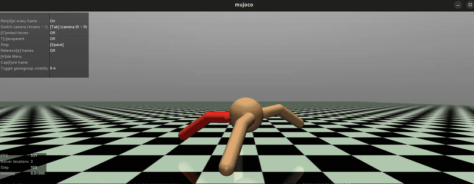
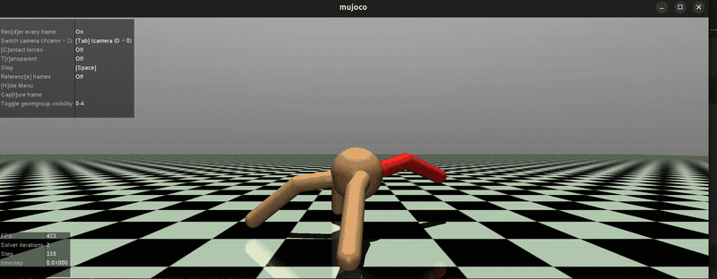
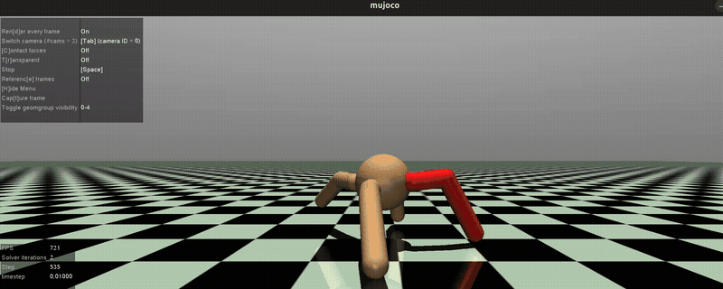
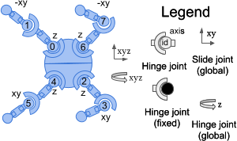
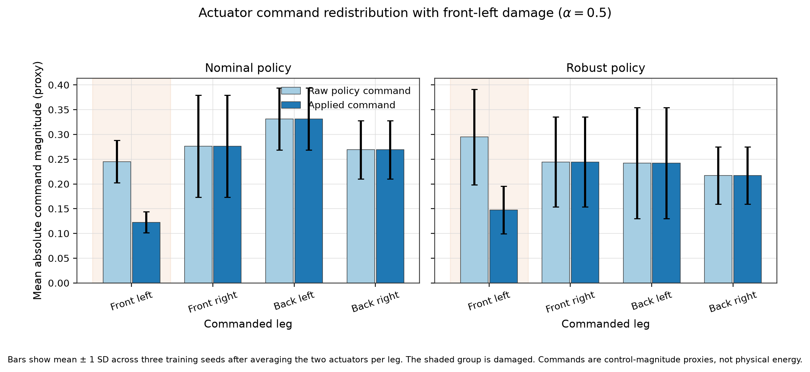

# Damage-Robust Locomotion of a Quadruped Robot Using Reinforcement Learning

<p align="center">
  
</p>

<p align="center"><em>Selected robust policy walking with complete front-right actuator loss.</em></p>

**AE4350 — Bio-Inspired Intelligence and Learning for Aerospace Applications**<br>
**Author:** Tommaso Calzolari<br>
**Student number:** 6430600<br>
**Delft University of Technology**

[Project report](docs/TommasoCalzolari6430600.pdf) ·
[Gymnasium Ant-v5 source](https://github.com/Farama-Foundation/Gymnasium/blob/main/gymnasium/envs/mujoco/ant_v5.py) ·
[MuJoCo](https://github.com/google-deepmind/mujoco) ·
[Stable-Baselines3 PPO source](https://github.com/DLR-RM/stable-baselines3/blob/master/stable_baselines3/ppo/ppo.py)

> **Research question:** How does training under randomized single-leg actuator
> degradation affect the robustness and healthy performance of a PPO locomotion
> controller?

This project compares PPO locomotion policies trained normally with policies
trained under randomized single-leg actuator degradation. Stable-Baselines3
provides PPO; this repository implements the Ant damage model, normalized
training pipeline, deterministic evaluation, manual viewer, experiment
launchers, result processing and figures.

The animation is a best-case deterministic demonstration. Both actuators of
the red front-right leg are disabled (`alpha = 0`); the policy traveled 89.6 m
without falling during the 1,000-step episode. The multi-seed results below
provide the experimental evidence.

## Project at a glance

| Component | Choice |
| --- | --- |
| Environment | Gymnasium `Ant-v5` with MuJoCo physics |
| Algorithm | Stable-Baselines3 PPO |
| Policy | Separate `[256, 256]` Tanh actor and critic networks |
| Comparison | Nominal training versus randomized-damage training |
| Main experiment | 3 seeds per condition, 5,000,000 requested steps per seed |
| Evaluation | Healthy, 50% remaining strength and complete failure; all four legs |
| Primary outcomes | Horizontal distance and early termination rate |
| Reproducibility | Fixed seeds, configuration metadata, raw episode CSVs and processed tables |

## Qualitative comparison

Both clips use training seed 6, evaluation seed 307 and 50% remaining strength
in the back-right leg. The initial state and damage condition are identical.

<table>
  <tr>
    <td align="center" width="50%">
      
    </td>
    <td align="center" width="50%">
      
    </td>
  </tr>
  <tr>
    <td align="center"><b>Nominal policy</b><br>51.7 m horizontal distance</td>
    <td align="center"><b>Robust policy</b><br>70.5 m horizontal distance</td>
  </tr>
</table>

These matched clips make the behavioral difference easy to see, but they were
selected for visual clarity. Conclusions are based on all policies and episode
seeds, not on these two trajectories alone.

## Installation

The project requires Python 3.10 or newer. It was developed and tested on
Ubuntu with CPU-only PyTorch. On Ubuntu or Debian, install the basic system
packages first:

```bash
sudo apt update
sudo apt install -y git python3 python3-venv libgl1 libglfw3
```

Clone the repository and create an isolated environment:

```bash
git clone https://github.com/tommasocalzolari/damage-robust-ant-rl.git
cd damage-robust-ant-rl

python3 -m venv .venv
source .venv/bin/activate
python -m pip install --upgrade pip
python -m pip install --index-url https://download.pytorch.org/whl/cpu "torch>=2.3,<3"
python -m pip install -e ".[dev]"
```

The editable install includes Gymnasium with MuJoCo, Stable-Baselines3,
TensorBoard, NumPy, pandas, Matplotlib and pytest. The explicit PyTorch command
uses the CPU wheel and avoids downloading unused CUDA libraries. Reactivate the
environment in each new terminal with:

```bash
source .venv/bin/activate
```

Verify the complete installation:

```bash
python -m pytest
```

The tests include a live `Ant-v5` reset-and-step check in addition to unit
tests for damage, training, evaluation and figure generation.

## Manual viewer

Open an uncontrolled Ant using smooth low-strength random commands:

```bash
python -m damage_robust_ant.view --speed 1.0
```

View the selected robust policy under 50% back-left strength:

```bash
python -m damage_robust_ant.view \
  --model artifacts/sensitivity/robust_seed_6_1m/lr_1em04_clip_0.1/final_model.zip \
  --normalizer artifacts/sensitivity/robust_seed_6_1m/lr_1em04_clip_0.1/vecnormalize.pkl \
  --damage-mode fixed --leg back_left --alpha 0.5 \
  --seed 503 --steps 1000 --speed 1.0 --goal-distance 100
```

The damaged leg is highlighted in red. `alpha` is the fraction of actuator
command that remains: `1.0` is healthy, `0.5` is half strength and `0.0` is
complete command loss. While the MuJoCo window is focused:

- press `Tab` once to use Ant's tracking camera;
- press `Space` to pause or resume;
- use `--speed 0.5` for half-speed playback.

---

To view the same nominal and robust policies used in the demo videos above,
run the following commands from the repository root:

```bash
.venv/bin/python -m damage_robust_ant.view \
  --model artifacts/final/nominal_seed_6/final_model.zip \
  --normalizer artifacts/final/nominal_seed_6/vecnormalize.pkl \
  --damage-mode fixed --leg back_right --alpha 0.5 \
  --seed 307 --speed 0.8

.venv/bin/python -m damage_robust_ant.view \
  --model artifacts/final/robust_seed_6/final_model.zip \
  --normalizer artifacts/final/robust_seed_6/vecnormalize.pkl \
  --damage-mode fixed --leg back_right --alpha 0.5 \
  --seed 307 --speed 0.8
```

Feel free to substitute a model and its matching `vecnormalize.pkl` from
`artifacts/`. You can also change `--seed`, select `front_left`, `front_right`,
`back_left` or `back_right` with `--leg`, and vary `--alpha` from `1.0` (no
strength loss) to `0.0` (complete actuator failure).

## Actuator damage model

<p align="center">
  
</p>

The action wrapper samples damage once when an episode resets and holds it
constant until that episode ends. It scales both commands associated with one
leg:

```text
policy action -> select one leg -> multiply its hip and ankle commands by alpha
              -> applied action sent to MuJoCo
```

| Leg | Action indices | MuJoCo target joints |
| --- | --- | --- |
| `front_left` | 2, 3 | `hip_1`, `ankle_1` |
| `front_right` | 4, 5 | `hip_2`, `ankle_2` |
| `back_left` | 6, 7 | `hip_3`, `ankle_3` |
| `back_right` | 0, 1 | `hip_4`, `ankle_4` |

The mapping was obtained programmatically from the `Ant-v5` MuJoCo model and
checked against the body layout in the
[official Ant-v5 documentation](https://gymnasium.farama.org/environments/mujoco/ant/).

Two training conditions are compared:

- **Nominal:** every action reaches all eight actuators unchanged.
- **Robust:** 25% of episodes are healthy. Otherwise, one of the four legs is
  selected uniformly and its remaining strength is sampled uniformly from
  `[0.25, 1.0]`.

The wrapper stores the command produced by PPO as `policy_action` and the
scaled command sent to MuJoCo as `applied_action`. Their mean absolute values
are command-magnitude proxies, not physical energy measurements.

## Training

Train one policy into a new output directory:

```bash
python -m damage_robust_ant.train \
  --condition robust \
  --seed 0 \
  --timesteps 500000 \
  --num-envs 4 \
  --learning-rate 0.0003 \
  --clip-range 0.2 \
  --output-dir artifacts/experiments/robust_seed_0
```

Training saves `final_model.zip`, `vecnormalize.pkl`, checkpoints, Monitor
CSVs, TensorBoard logs and complete metadata. Output directories are never
silently reused.

The fixed six-policy experiment was launched with:

```bash
./run_main_experiment.sh --dry-run
./run_main_experiment.sh
```

The dry run prints all six training and 54 evaluation commands without writing
files. The real launcher tests the repository, trains nominal and robust seeds
5, 6 and 7 for five million requested steps each, and then evaluates all six
policies automatically. It prints progress approximately every five minutes
and preserves partial outputs if interrupted. It also refuses to overwrite an
existing `artifacts/final/` directory. Final models, normalizers, logs and
evaluation data are retained in Git, while the bulky final-run checkpoints stay
ignored. The sensitivity directory is retained in full, including checkpoints.

Inspect a training run with TensorBoard:

```bash
tensorboard --logdir artifacts/final
```

Then open <http://localhost:6006> and press `Ctrl+C` when finished.

## Experimental workflow

Development followed a short test–pilot–experiment cycle:

1. Verify MuJoCo, implement the damage wrapper and test exact scaling and
   deterministic seeding.
2. Add training, evaluation and viewing tools, then validate them with tests,
   smoke runs and bounded pilots.
3. Diagnose failed early policies and stabilize PPO using observation and
   reward normalization, a linear learning-rate schedule, `target_kl=0.02`
   and a healthy reward of `3.0`.
4. Train the final six policies for five million steps and evaluate them on
   common seeds under healthy, moderate-damage and complete-failure cases.
5. Run the four-configuration sensitivity study on robust seed 6 and evaluate
   the selected refinement on new held-out seeds.

Automated tests and short pilot runs preceded every expensive training stage.

## Results

The final comparison contains 540 deterministic evaluation episodes. Values
below are means across the three training-seed means; uncertainty is the sample
standard deviation across those three seeds.

| Remaining strength | Nominal horizontal distance | Robust horizontal distance | Nominal early termination | Robust early termination |
| ---: | ---: | ---: | ---: | ---: |
| 1.0, healthy | 35.17 ± 15.69 m | 35.40 ± 32.87 m | 0.0% | 6.7% |
| 0.5 | 24.55 ± 6.42 m | 30.42 ± 29.32 m | 0.0% | 0.0% |
| 0.0 | 8.07 ± 3.26 m | 10.06 ± 5.08 m | 0.0% | 0.0% |

Seed 6 was the best policy in each training condition when performance was
averaged across the three severity groups. The table below uses the same final
evaluation seeds as the main comparison.

| Remaining strength | Nominal seed 6 distance | Robust seed 6 distance | Nominal early termination | Robust early termination |
| ---: | ---: | ---: | ---: | ---: |
| 1.0, healthy | 47.53 m | 73.32 m | 0.0% | 10.0% |
| 0.5 | 25.34 m | 64.28 m | 0.0% | 0.0% |
| 0.0 | 9.89 m | 15.14 m | 0.0% | 0.0% |

<p align="center">
  
</p>

With the front-left leg at half strength, the robust policy requests a somewhat
larger command from the damaged leg while keeping the three undamaged leg
commands at similar magnitudes. Only the damaged command is reduced before it
reaches the simulator; the other commands remain unchanged. Together with the
distance results, this pattern is consistent with the robust policy learning to
redistribute effort while maintaining a balanced command pattern. Command
magnitudes are only control proxies, so the plot supports this interpretation
without directly measuring balance forces or mechanical energy.

Across all seeds, robust training improved mean distance under damage while
leaving healthy distance nearly unchanged. The large variation between seeds,
especially the strong seed-6 result, prevents a general claim of improvement.

The sensitivity study selected learning rate `1e-4` and clip range `0.1` for
robust seed 6. After about one million additional steps, held-out mean distance
was 67.96 m when healthy and 73.68 m at `alpha=0.5`, compared with 60.16 m and
57.15 m before refinement. This selected-seed result remains separate from the
main comparison.

The selected demonstration model is stored at
`artifacts/sensitivity/robust_seed_6_1m/lr_1em04_clip_0.1/final_model.zip`.
The `1m` directory name denotes the additional sensitivity-training budget;
the model contains 6,012,928 cumulative environment steps.

The main limitations are the three training seeds, strong seed sensitivity,
one selected sensitivity seed and simulated single-leg damage. The complete
episode data are retained so this variation remains visible.

## Report

The complete AE4350 report is available at
[`docs/TommasoCalzolari6430600.pdf`](docs/TommasoCalzolari6430600.pdf). The report contains the full method, results,
discussion, limitations and references; this README is the concise repository
and reproduction guide.

## Repository layout

```text
damage-robust-ant-rl/
├── artifacts/
│   ├── final/
│   └── sensitivity/
├── docs/
├── figures/
├── results/
├── src/damage_robust_ant/
│   ├── damage.py
│   ├── train.py
│   ├── evaluate.py
│   ├── view.py
│   ├── sensitivity.py
│   └── figures.py
├── tests/
├── videos/finals/
├── run_main_experiment.sh
└── pyproject.toml
```

`src/` contains the damage, training, evaluation, viewer, sensitivity and
figure code. `results/`, `figures/` and `videos/finals/` contain the material
used in the report. The final and sensitivity artifacts needed to inspect the
reported experiments are versioned; unrelated runs and raw recordings remain
ignored.
